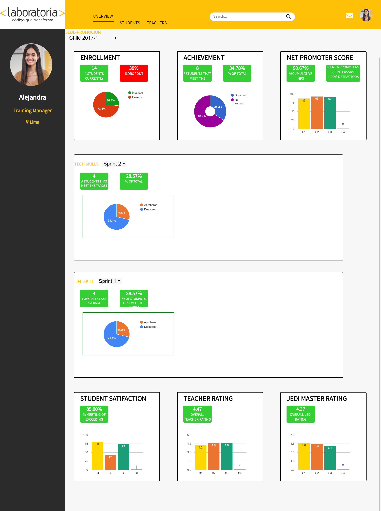
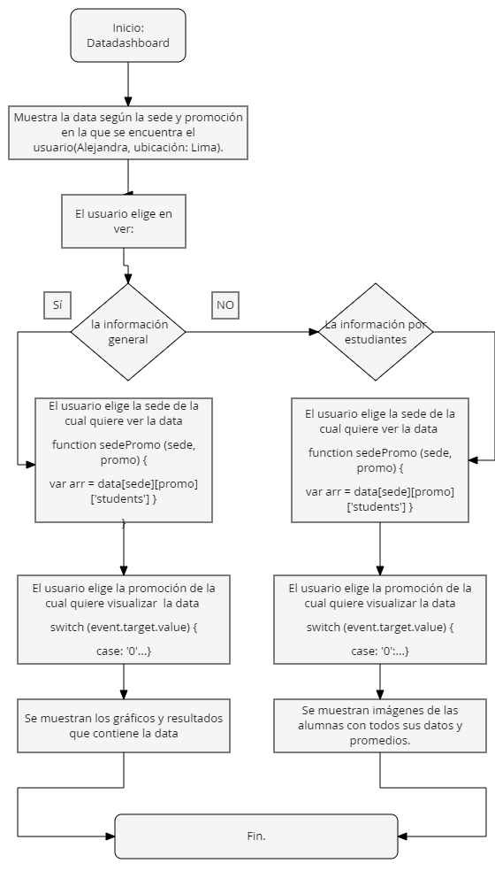
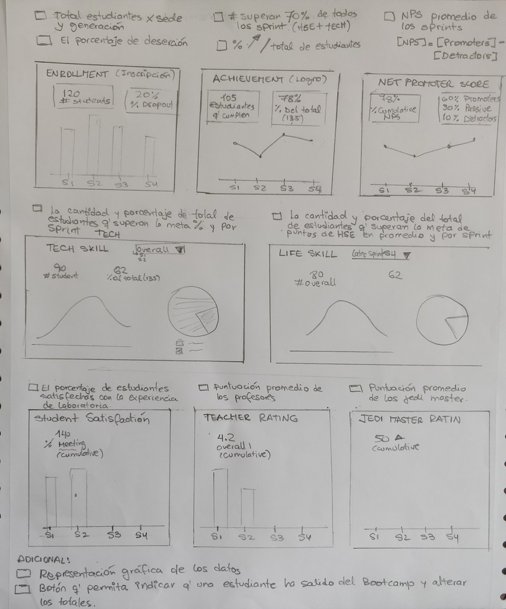
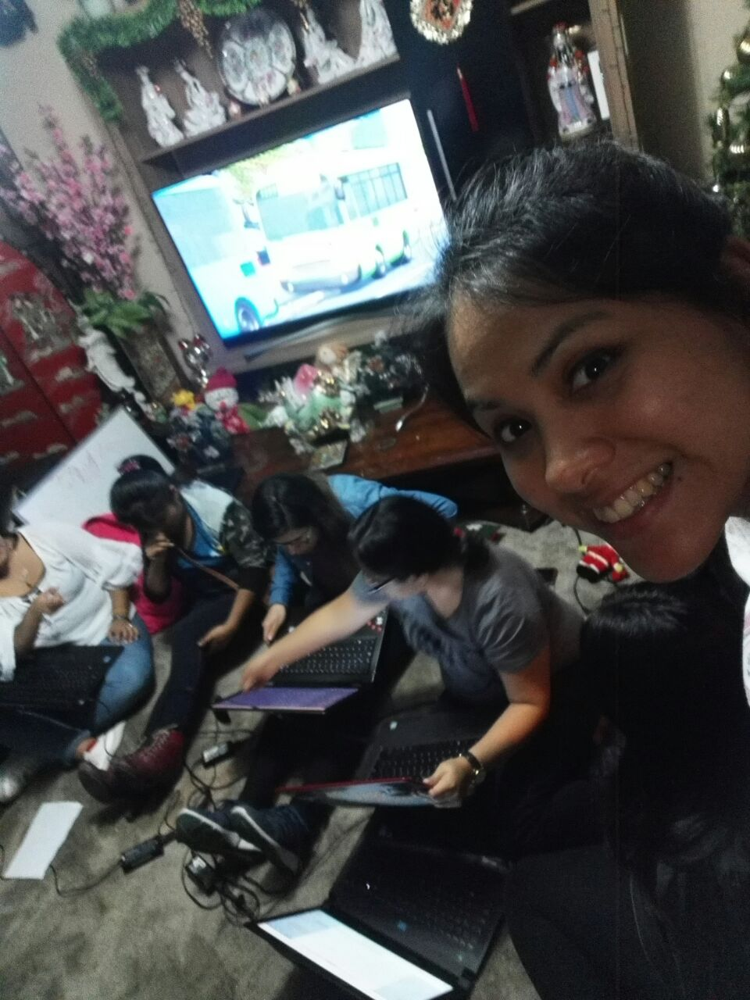
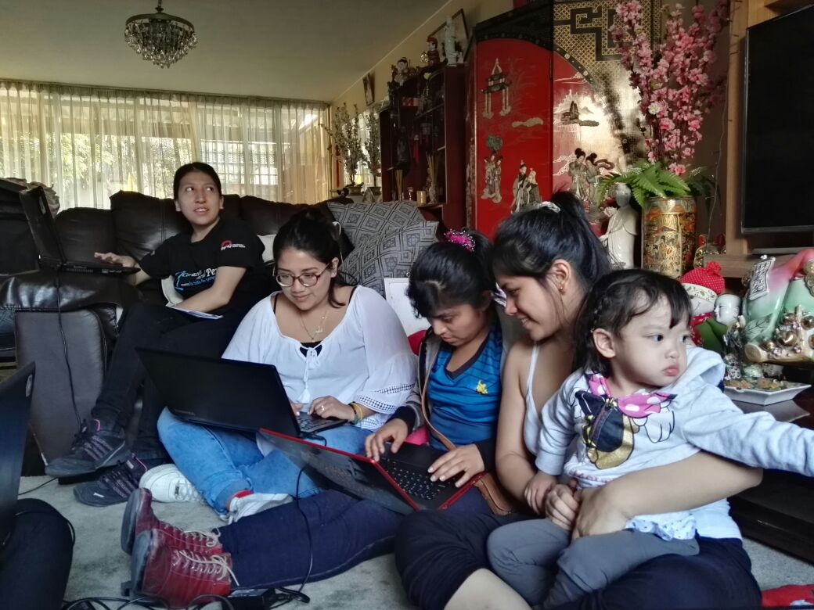
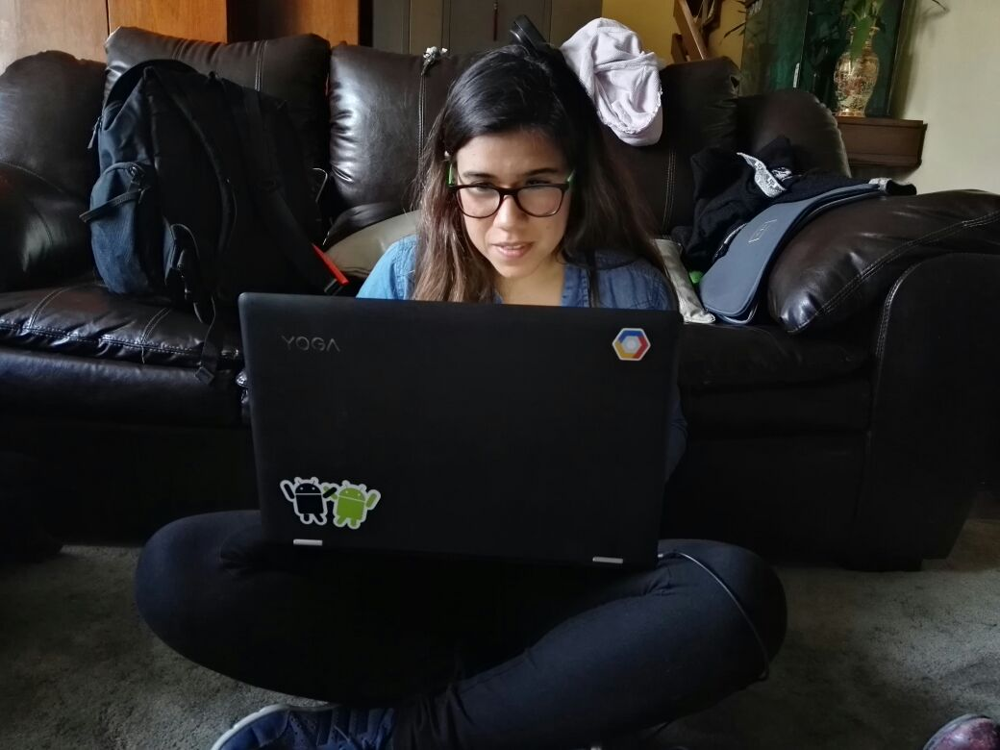

## DATA DASHBOARD
Data dashboard es una herramienta por la cual Laboratoria puede analizar la mayor cantidad de datos posibles respecto al desempeño de las estudiantes.

## Desarrollado para
[Laboratoria](http://laboratoria.la)

* **Track:** _Common Core._
* **Curso:** _Creando un sitio web interactivo con javascript._
* **Unidad:** _Data Dashboard._
* **Squad:** _Ayllu Coders._
* **Integrantes:** _Aurora Vásquez_ - _Stephanie Wong_ - _Alexandra Calderón_- _Claudia Gariboto_ - _Vanessa Mendoza_ - _Lidia Ramirez_ - _Yosseline Apcho_.

***

## Objetivos del produto final:

_Este producto final consistió en:_

**Crear una herramienta web, donde las TMs puedan ver los datos nombrados a continuación, de una manera fácil y rápida,  permitiendo así optimizar sus tiempos a la hora de  visualizar todos los datos posibles respecto al desempeño de las estudiantes para apoyarlas en su aprendizaje. Dichos datos serían:**

* El total de estudiantes presentes por sede y generación.
* El porcentaje de deserción de estudiantes.
* La cantidad de estudiantes que superan la meta de puntos en promedio de todos los sprints cursados. La meta de puntos es 70% del total de puntos en HSE y en tech.
* El porcentaje que representa el dato anterior en relación al total de estudiantes.
* El Net Promoter Score (NPS) promedio de los sprints cursados. El NPS se calcula en base a la encuesta que las estudiantes responden al respecto de la recomendación que darían de Laboratoria, bajo la siguiente fórmula:

~~~
[Promoters] = [Respuestas 9 o 10] / [Total respuestas] * 100
[Passive] = [Respuestas 7 u 8] / [Total respuestas] * 100
[Detractors] = [Respuestas entre 1 y 6] / [Total respuestas] * 100

[NPS] = [Promoters] - [Detractors]
~~~

* La cantidad y el porcentaje que representa el total de estudiantes que superan la meta de puntos técnicos en promedio y por sprint.
* La cantidad y el porcentaje que representa el total de estudiantes que superan la meta de puntos de HSE en promedio y por sprint.
* El porcentaje de estudiantes satisfechas con la experiencia de Laboratoria.
* La puntuación promedio de l@s profesores.
* La puntuación promedio de l@s jedi masters.

_Adicional:_

* Poder mostrar los datos procesados en un gráfico como el diseño propone u otra alternativa.

* Tener un botón que permita indicar que una estudiante ha salido del Bootcamp y alterar los totales afectados por este cambio.

***

## Consideraciones:

* Para poder realizar el 'Code Review':*

* Todas las integrantes del Squad explicaron brevemente su código y obtuvieron feedback sobre la limpieza y orden de lo ya mencionado.

* Analizamos todos y cada uno de los productos finales, y elegimos el código que tiene un html y css mucho más organizado. Luego, recogimos lo mejor de cada integrante, y procedimos a pulir el código, para así construir en equipo el mejor producto final.

* Finalmente, todas nos preparamos para dar una buena exposición.

***

## Plan de acción:

* Antes de construir nuestro programa, hicimos un flujograma.

* Como motivo de ayuda, realizamos un sketch con los puntos que nos pedían realizar, para así aclarar nuestras dudas.

* Además realizamos un mockup de nuestro sketching.

[Dashboard-Marvel](https://marvelapp.com/5a5b65b/screen/35762645/handoff).

***

## Agenda:

### Día 1

* En el aula, coordinamos los lugares y las horas en las que nos íbamos a reunir para realizar el trabajo en equipo.

### Día 2

* Un grupo de compañeras (Lidia, Claudia) se reunió el día sábado para dar comienzo al perfeccionamiento del código.

### Día 3

* El Squad se reunió en casa de una compañera (Stephanie) el día domingo y procedimos a continuar trabajando en el proyecto.

### Fotos referenciales:

___

### **Alumnas**

>##### Lidia Ramirez
>##### Vanessa Mendoza Inoñan
>##### Claudia Garibotto
>##### Yosseline Apcho
>##### Aurora Vasquez
>##### Stephanie Wong
>##### Alexandra Calderon
